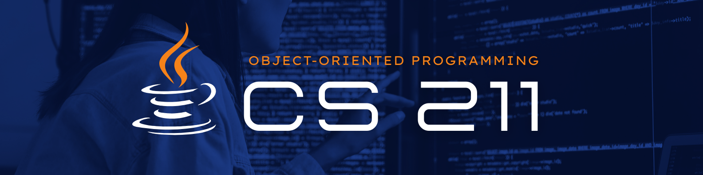

   

# 🌟💻 CS 211 Repository 

Welcome to my **CS 211 Repository**! This repository serves as a comprehensive archive of my work throughout the **CS-211 Object-Oriented Programming** course. It showcases my journey from learning the fundamentals of programming to developing robust, real-world applications using **Java**. 

This repository not only highlights my academic achievements but also demonstrates the practical skills I've developed, preparing me for future endeavors in the world of software development.

Feel free to dive into the code, explore my projects, and see how I've evolved as a programmer! 

 

# ☕ **Table of Contents**
💻 [**1. Course Introduction**](#course_intro)  
💻 [**2. Course Requirements Checklist**](#course_reqs)  
💻 [**3. Exercise Sets**](#exercise_sets)  
💻 [**4. Laboratory Activities**](#lab_acts)  
💻 [**5. Acknowledgement**](#proj_acknowledgement)  
💻 [**6. Resource Developer**](#rsrc_developer)  
 

# <a id = "course_intro"> ☕ Course Introduction </a> 
 **CS-211 Object-Oriented Programming** is a core course designed to deepen students' understanding of software design and development using object-oriented principles. The programming language of focus for this course is **Java**, a versatile and widely-used language renowned for its robustness, simplicity, and powerful object-oriented features.

Through Java, this course introduces a structured approach to solving complex problems by creating modular, reusable, and maintainable code. It not only strengthens programming skills but also lays a strong foundation for advanced software development and engineering concepts.

---
### 🌟 Key Topics Covered 🌟  
&nbsp;&nbsp;&nbsp;&nbsp;🔹 **Module 1:** Introduction to Java  
&nbsp;&nbsp;&nbsp;&nbsp;🔹 **Module 2:** Java Flow Control  
&nbsp;&nbsp;&nbsp;&nbsp;🔹 **Module 3:** Java Functions and Arrays  
&nbsp;&nbsp;&nbsp;&nbsp;🔹 **Module 4:** Encapsulation  
&nbsp;&nbsp;&nbsp;&nbsp;🔹 **Module 5:** Inheritance  
&nbsp;&nbsp;&nbsp;&nbsp;🔹 **Module 6:** Polymorphism  
&nbsp;&nbsp;&nbsp;&nbsp;🔹 **Module 7:** Abstraction  
&nbsp;&nbsp;&nbsp;&nbsp;✨ **Bonus Topics:** Collections & Exception Handling

---
 

# <a id="course_reqs"> ✅ Course Requirements Checklist </a>

This **checklist** includes all the required **exercise sets**, **laboratory activities**, and the **final project** for CS-211 Object-Oriented Programming.
### 💻 **Exercise Sets**  
- [x] **Exercise Set 01**  
- [x] **Exercise Set 02**  

### 💻 **Laboratory Activities**  
- [x] **Laboratory Activity 01**  
- [x] **Laboratory Activity 02**  
- [x] **Laboratory Activity 03**  
- [ ] **Laboratory Activity 04**  

### 💻 **Final Project**  
- [ ] Java Console Program
 

# <a id="exercise_sets"> ☕ Exercise Sets </a>

###  🌟 **Overview of Exercise Sets for CS 211** 🌟

| **Exercise Set**           | **Topics Covered**                         | **Files Included**                                         |
|----------------------------|--------------------------------------------|------------------------------------------------------------|
| **💻 Exercise Set 01**      | Introduction to Java                       | `Escseq.java`, `Tempconvert.java`, `Welcome.java`           |
| **💻 Exercise Set 02**      | Encapsulation                              | `Car.java`, `Main.java`                                     |

---
🔍 **Exercise Set 01**  
> Covers Java basics including input/output handling, escape sequences, and working with data types. The exercises help practice foundational concepts through simple Java programs.

🔍 **Exercise Set 02**  
> Focuses on **Encapsulation** in Java, teaching you how to define classes, protect data with access modifiers, and create getters and setters. This exercise is crucial for understanding the importance of data protection in object-oriented design.
 

# <a id = "lab_acts"> ☕ Laboratory Activities </a> 
### 🌟 Overview of Lboratory Activities for CS 211 🌟
| **Laboratory Activity**  | **Topics Covered**                                         | **Files Included**                                           |
|--------------------------|------------------------------------------------------------|--------------------------------------------------------------|
| **💻 Laboratory Activity 01** | Introduction to Java                                      | `GettingGreater.java`, `GettingInputs.java`                   |
| **💻 Laboratory Activity 02** | Java Flow Control, Arrays, and Functions                   | `GetArrayMean.java`, `MultiplicationTable.java`               |
| **💻 Laboratory Activity 03** | Encapsulation, Inheritance, Polymorphism                   | `Artist.java`, `Dancer.java`, `ArtistDemo.java`, `Painter.java`, `Singer.java`, `Writer.java` |
| **💻 Laboratory Activity 04** | Abstraction               | `Main.java`, `Shape.java`, `Rectangle.java`, `Square.java`, `Triangle.java`, `ShapeCollection.java`, `Lab4-output.png`|

---
🔍 **Laboratory Activity 1** 
> Covers Java basics, including user input/output, character comparison, and displaying ASCII values through simple Java programs.

🔍 **Laboratory Activity 2** 
> Covers Java flow control, arrays, and functions, with exercises on calculating array mean and generating a multiplication table.

🔍 **Laboratory Activity 3**  
> Focuses on Encapsulation, Inheritance, and Polymorphism, using the `Artist` class as a base class for subclasses like `Singer`, `Painter`, and `Dancer`.

🔍 **Laboratory Activity 4**  
> Covers the concept Abstraction using shapes, including working with abstract classes and collections.
 

# <a id = "proj_acknowledgement"> ☕ Acknowledgement </a> 

I would like to express my sincere gratitude to **Ms. Fatima Marie P. Agdon**, our course facilitator and instructor for **CS 211 - Object-Oriented Programming**. Her passion for teaching and dedication to her students have made a lasting impact on my understanding of OOP. With her clear explanations, thoughtful feedback, and constant encouragement, she has helped me navigate the challenges of programming with confidence. I truly appreciate her support and the engaging learning environment she created, which made every lesson a valuable experience. 

**Thank you, Ms. Agdon, for your guidance and inspiration throughout this course.** 💝💻
 

# <a id = "rsrc_developer"> ☕ Resource Developer </a> 

   

### 🌟 About the Developer 🌟

Hi! I’m **Anthonina Dhapniella C. Vael**, a second-year **BS Computer Science** student. Although I’ve faced challenges in programming, **CS 211** was both tough and rewarding, pushing me to grow as a coder. Coding has become more enjoyable, and I’m excited to continue learning and improving in the field! 💝💻

I’m also excited to share my final project, **FitSpace**—a facility management system for the Fitness Development Center of Batangas State University- Alangilan Campus. It’s been a great experience applying what I’ve learned to this project.

Check out the source code on my [GitHub Repository](https://github.com/andavael/FitSpace). Your feedback is welcome!

